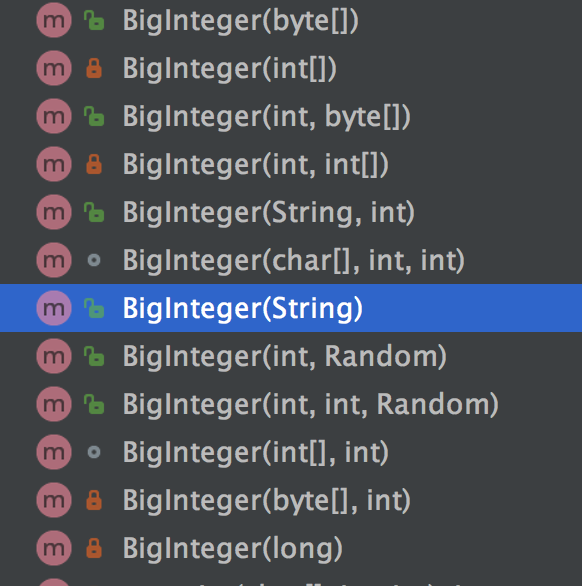
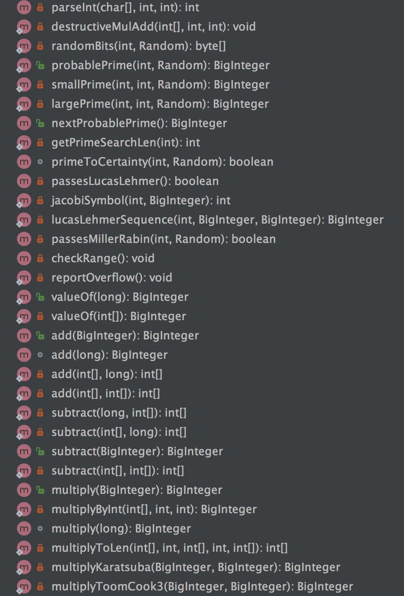
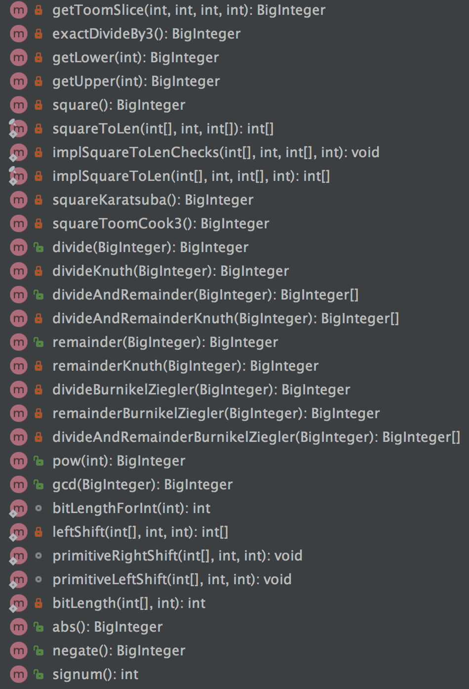
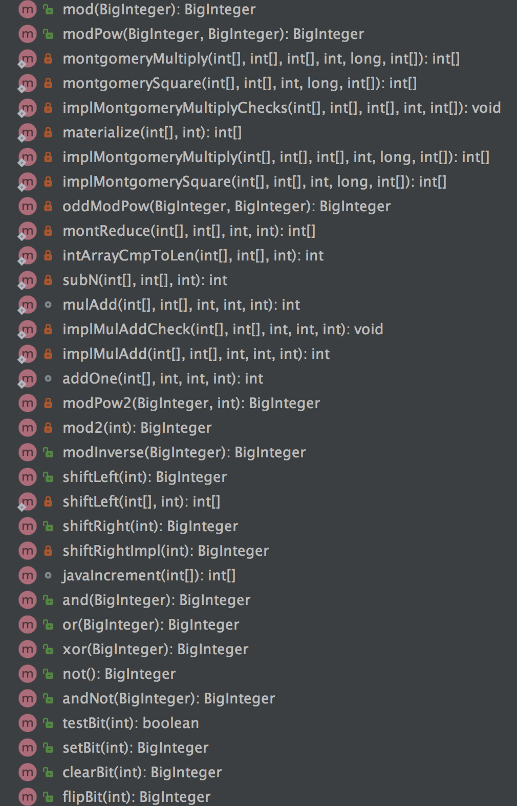
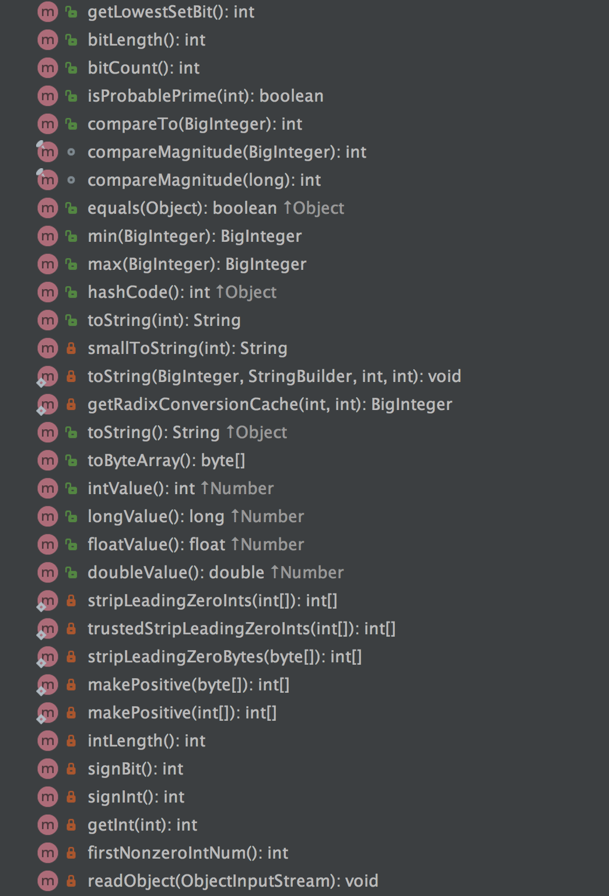

# BigInteger精讲

## BigInteger初识

在java的整数类型里面，byte为8位，short为16位，int为32位，long为64位。
正因为这些数值的二进制位数已经固定，所以它们能表示的数值大小就有一定的范围限制。
如果想表示比这些数值更大的数，怎么办呢？可以使用BigInteger来帮忙.
BigInteger用多少位二进制表示呢？其实，在BigInteger里面使用int数组来存储实现的.

为什么java里面要出现BigInteger类型呢？相信很多人有这个疑问，其实原因很简单，它可以表达更大范围的数值，远远比long表示的最大值还要大的多数。

在整数类型里面，long可以表达最大值，如下所示：

```java

public class Test
{
	public static void main(String[] args)
	{
		System.out.println(Long.MAX_VALUE);
	}
}
```

结果为：9223372036854775807
而使用BigInteger，则可以表示更大的值，如下面的例子：

```java
public class Test
{
	public static void main(String[] args)
	{
		BigInteger a= BigInteger.valueOf(9223372036854775807L);
		BigInteger b= BigInteger.valueOf(9223372036854775807L);
		BigInteger c=a.add(b);
		System.out.println(c.toString());
	}
}
```

结果为：18446744073709551614
下面说一下BigInteger的常用函数，这些函数在编程的时候会用到的。
因为BigInteger没有重载"+"，"-"，"*"，“/”， “%”这五个运算操作符，是不能直接进行数据运算的，
需要调用它的相应方法：add，subtract，multiply，divide，remainder

## BigInteger构造函数分析

BigInteger构造函数如下:



给构造函数传入不同的参数都会转变为BigInteger类型.具体使用可查看相应api.

## BigInteger常用函数分析

先来看看BigInteger的所有函数:





* 比较函数: 

`int compareTo(BigInteger val)`//比较大小
`BigInteger min(BigInteger val)`//返回较小的
`BigInteger max(BigInteger val)`//返回较大的


## BigInteger经常遇到的用法

本文给大家说一下BigInteger的常见问题，总共有8个常见的问题，如下所示。

### 问题一：在java怎样将BigInteger类型的数据转成int类型的？

答案：BigInteger的intValue()可以获得int类型数值。

```java
/**
     * Converts this BigInteger to an {@code int}.  This
     * conversion is analogous to a
     * <i>narrowing primitive conversion</i> from {@code long} to
     * {@code int} as defined in section 5.1.3 of
     * <cite>The Java&trade; Language Specification</cite>:
     * if this BigInteger is too big to fit in an
     * {@code int}, only the low-order 32 bits are returned.
     * Note that this conversion can lose information about the
     * overall magnitude of the BigInteger value as well as return a
     * result with the opposite sign.
     *
     * @return this BigInteger converted to an {@code int}.
     * @see #intValueExact()
     */
    public int intValue() {
        int result = 0;
        result = getInt(0);
        return result;
    }
```

### 问题二：在哪里可以查看BigInteger的代码实现？

答案：在jdk里面的java.math包下面就可以看到

### 问题三：在JAVA中BigInteger.ZERO是什么意思？

答案：在BigInteger内部定义的 一个代表 数字零 的常量，如下所示：

```java


public static final BigInteger ZERO = new BigInteger(new int[0], 0);
```

### 问题四：在java中 有没有比BigInteger范围更大的？遇到比BigInteger范围更大的情况是不是只能用数组解决了？

答案：在java中没有比BigInteger范围更大数了。
BigInteger类可以处理包含任意长度数字序列的数值，因为在BigInteger内部是通过int 数组来表示和处理大数据的，
int类型的最大值是2147483647，所以int数组最多有21亿个int值，这些数值足够大的，已经满足了超大数据的使用。


### 问题五：java.math.BigInteger有位数限制么？比如long是2的64次方。

答案：从BigInteger的源码可以看出来，在BigInteger内部数值是通过：int[] mag存放数据的，
总共可以存放2147483647个int数据，而每个int数据由4个字节表示，所以BigInteger理论上可以存放的数据最大为2 的2147483647*4*8-1-1次方


